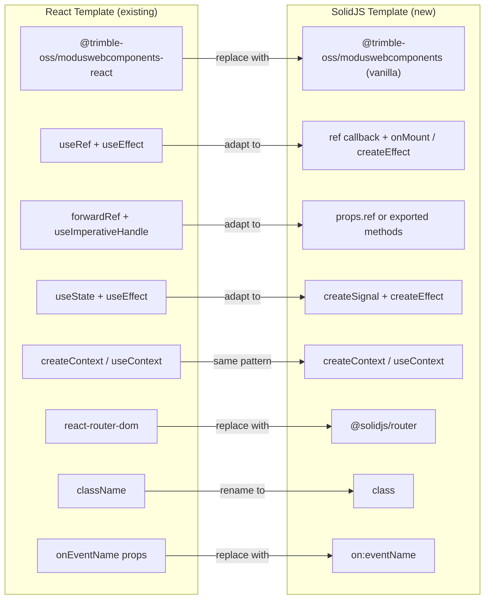

# SolidJS + Modus 2.0 Boilerplate Template Plan

## Context

The existing React template at `[templates/react/](templates/react/)` uses `@trimble-oss/moduswebcomponents-react` (React-specific wrappers) on top of the vanilla Modus web components. For SolidJS, there is **no official `moduswebcomponents-solid` package** -- the trimble-web-apps monorepo uses vanilla `@trimble-oss/moduswebcomponents` directly in SolidJS JSX with `on:eventName` for custom events and `attr:propName` for attribute passthrough. The template should create **SolidJS wrapper components** (like the React template does) on top of the vanilla web components.

---

## Pinned Versions (from trimble-web-apps + npm)

| Package                         | Version | Notes                                           |
| ------------------------------- | ------- | ----------------------------------------------- |
| solid-js                        | 1.9.5   | Stable; matches trimble-web-apps. NOT v2.0-beta |
| @solidjs/router                 | 0.15.4  | Latest stable                                   |
| vite-plugin-solid               | 2.11.10 | Latest, Vite 7 compatible                       |
| @trimble-oss/moduswebcomponents | ^1.0.7  | Vanilla web components (no React wrappers)      |
| @trimble-oss/modus-icons        | ^1.18.1 | Same as React template                          |
| vite                            | ^7.1.7  | Same as React template                          |
| typescript                      | ~5.9.3  | Same as React template                          |
| tailwindcss                     | ^3.4.18 | Same as React template                          |
| vitest                          | ^3.0.8  | Matches trimble-web-apps                        |
| @solidjs/testing-library        | ^0.8.10 | Latest stable                                   |
| @testing-library/jest-dom       | ^6.6.3  | DOM matchers                                    |
| eslint                          | ^9.36.0 | Same as React template                          |
| husky                           | ^9.1.7  | Same as React template                          |

---

## Architecture: React vs SolidJS Pattern Mapping



---

## Project Structure

Mirror the React template structure 1:1, adapting file extensions and framework-specific files:

```
templates/solidjs/
  .cursor/
    rules/                    # SolidJS-adapted Modus rules (.mdc)
    skills/                   # SolidJS-adapted Modus skills
    commands/
    mcp.json
  .github/
    workflows/
      ci.yml                  # Node 20, npm ci, lint, type-check, build
      claude.yml
      claude-code-review.yml
    ISSUE_TEMPLATE/
    pull_request_template.md
    CODEOWNERS
  .husky/
    pre-commit                # Same lint hooks
  .vscode/
    extensions.json
  public/
    vite.svg
  scripts/
    check-typescript.js       # Reuse from React
    check-modus-icons.js      # Reuse from React
    check-modus-colors.js     # Reuse from React
    check-semantic-html.js    # Reuse (change .tsx scan to .tsx)
    check-inline-styles.js    # Reuse from React
    check-border-violations.js
    check-opacity-utilities.js
    check-icon-names.js
  src/
    index.tsx                 # Entry: render + setAssetPath + defineCustomElements
    App.tsx                   # Root component with providers + router
    index.css                 # Modus CSS variables + Tailwind
    App.css
    vite-env.d.ts             # Vite client types
    solid-modus.d.ts          # TypeScript declarations for modus-wc-* JSX intrinsic elements
    assets/
    components/               # ~40+ SolidJS wrapper components for Modus WC
      ModusProvider.tsx
      ModusButton.tsx
      ModusCheckbox.tsx
      ModusModal.tsx
      ModusIcon.tsx
      ModusAlert.tsx
      ModusAccordion.tsx
      ModusBadge.tsx
      ModusCard.tsx
      ModusDropdownMenu.tsx
      ModusNavbar.tsx
      ModusSideNavigation.tsx
      ModusSelect.tsx
      ModusSwitch.tsx
      ModusTabs.tsx
      ModusTextInput.tsx
      ModusTooltip.tsx
      ... (all components from React template)
    contexts/
      ThemeContext.tsx         # SolidJS context with createContext + createSignal
    hooks/
      useTheme.ts             # useContext(ThemeContext)
    config/
      routes.ts
    data/
      modusIcons.ts           # Reuse from React
    dev/
      index.ts
      config.ts
      DevPanel.tsx
      DevPanelProvider.tsx
      DevPanelContext.ts
      DevRoutes.tsx
      useDevPanel.ts
    dev-pages/
      IconsPage.tsx
      ColorPalettePage.tsx
      ComponentsGalleryPage.tsx
    demos/                    # Component demo pages (port from React)
    pages/
      HomePage.tsx
  index.html
  package.json
  vite.config.ts
  tsconfig.json
  tsconfig.app.json
  tsconfig.node.json
  tailwind.config.js          # Reuse from React (identical)
  postcss.config.js           # Reuse from React (identical)
  eslint.config.js            # SolidJS-adapted (eslint-plugin-solid)
  gitignore
  dot-npmrc                   # Renamed to .npmrc by scaffold
  README.md
  CLAUDE.md                   # SolidJS-adapted
  AGENTS.MD
  SECURITY.md
  LICENSE
  CONTRIBUTING.md
  CODE_OF_CONDUCT.md
```

---

## Key Implementation Details

### 1. `package.json`

```json
{
  "name": "modus-solidjs-app",
  "private": true,
  "version": "0.0.0",
  "type": "module",
  "scripts": {
    "dev": "vite",
    "build": "vite build",
    "lint": "eslint .",
    "preview": "vite preview",
    "test": "vitest run",
    "test:watch": "vitest",
    "type-check": "node scripts/check-typescript.js",
    "lint:icons": "node scripts/check-modus-icons.js",
    "lint:semantic": "node scripts/check-semantic-html.js",
    "lint:colors": "node scripts/check-modus-colors.js",
    "lint:styles": "node scripts/check-inline-styles.js",
    "lint:borders": "node scripts/check-border-violations.js",
    "lint:opacity": "node scripts/check-opacity-utilities.js",
    "lint:icon-names": "node scripts/check-icon-names.js",
    "lint:all": "npm run type-check && npm run lint:icons && ...",
    "prepare": "husky || true"
  },
  "dependencies": {
    "@trimble-oss/moduswebcomponents": "^1.0.7",
    "@trimble-oss/modus-icons": "^1.18.1",
    "solid-js": "1.9.5",
    "@solidjs/router": "^0.15.4",
    "autoprefixer": "^10.4.21",
    "postcss": "^8.5.6",
    "tailwindcss": "^3.4.18"
  },
  "devDependencies": {
    "@eslint/js": "^9.36.0",
    "eslint": "^9.36.0",
    "eslint-plugin-solid": "^0.14.0",
    "globals": "^16.4.0",
    "glob": "^11.0.3",
    "husky": "^9.1.7",
    "typescript": "~5.9.3",
    "typescript-eslint": "^8.45.0",
    "vite": "^7.1.7",
    "vite-plugin-solid": "^2.11.10",
    "vite-plugin-static-copy": "^3.2.0",
    "vitest": "^3.0.8",
    "@solidjs/testing-library": "^0.8.10",
    "@testing-library/jest-dom": "^6.6.3",
    "jsdom": "^25.0.0"
  }
}
```

### 2. `vite.config.ts`

```typescript
import { defineConfig } from "vite";
import solidPlugin from "vite-plugin-solid";
import { viteStaticCopy } from "vite-plugin-static-copy";

export default defineConfig({
  plugins: [
    solidPlugin(),
    viteStaticCopy({
      targets: [
        {
          src: "node_modules/@trimble-oss/moduswebcomponents/modus-wc/assets/*",
          dest: "modus-wc/assets",
        },
      ],
    }),
  ],
});
```

### 3. `tsconfig.app.json`

Key difference from React: `jsx: "preserve"` with `jsxImportSource: "solid-js"`.

```json
{
  "compilerOptions": {
    "target": "ES2022",
    "module": "ESNext",
    "moduleResolution": "bundler",
    "jsx": "preserve",
    "jsxImportSource": "solid-js",
    "strict": true,
    "noEmit": true,
    "types": ["vite/client"],
    "lib": ["ES2022", "DOM", "DOM.Iterable"],
    "noUnusedLocals": true,
    "noUnusedParameters": true,
    "noFallthroughCasesInSwitch": true
  },
  "include": ["src"]
}
```

### 4. Entry Point (`src/index.tsx`)

```typescript
import { render } from "solid-js/web";
import { setAssetPath } from "@trimble-oss/moduswebcomponents/components";
import { defineCustomElements } from "@trimble-oss/moduswebcomponents/loader";

setAssetPath(window.location.origin + "/modus-wc/");
defineCustomElements();

import App from "./App";
import "./index.css";

render(() => <App />, document.getElementById("root")!);
```

### 5. Wrapper Component Pattern (SolidJS adaptations)

**Pattern 1: Simple pass-through (ModusButton)**

SolidJS uses web components directly in JSX. No need for `@trimble-oss/moduswebcomponents-react`. Props pass through with `attr:` prefix for HTML attributes and `on:` prefix for custom events:

```typescript
import type { JSX, ParentComponent } from "solid-js";

const ModusButton: ParentComponent<ModusButtonProps> = (props) => {
  return (
    <modus-wc-button
      attr:color={props.color}
      attr:variant={props.variant}
      size={props.size ?? "md"}
      disabled={props.disabled}
      on:buttonClick={props.onButtonClick}
      custom-class={props.className}
    >
      {props.children}
    </modus-wc-button>
  );
};
```

**Pattern 2: Event handling with ref + onMount (ModusCheckbox)**

Replace React's `useRef` + `useEffect` with SolidJS `ref` callback + `onMount` + `onCleanup`:

```typescript
import { onMount, onCleanup } from "solid-js";

const ModusCheckbox: Component<ModusCheckboxProps> = (props) => {
  let checkboxRef: HTMLElement | undefined;

  onMount(() => {
    if (!checkboxRef) return;
    const handleValueChange = (event: Event) => {
      const rawValue = (event.target as any).value;
      const actualValue = !rawValue;
      props.onValueChange?.(new CustomEvent("valueChange", { detail: actualValue }));
    };
    checkboxRef.addEventListener("inputChange", handleValueChange);
    onCleanup(() => checkboxRef?.removeEventListener("inputChange", handleValueChange));
  });

  return (
    <modus-wc-checkbox
      ref={checkboxRef}
      value={props.value}
      label={props.label}
      disabled={props.disabled}
    />
  );
};
```

**Pattern 3: Imperative API (ModusModal)**

SolidJS doesn't have `forwardRef`/`useImperativeHandle`. Instead, expose methods via a callback ref or an `onRef` prop:

```typescript
export interface ModusModalRef {
  openModal: () => void;
  closeModal: () => void;
}

const ModusModal: ParentComponent<ModusModalProps> = (props) => {
  let modalRef: HTMLElement | undefined;

  const openModal = () => {
    const dialog = modalRef?.querySelector("dialog") as HTMLDialogElement;
    dialog?.showModal();
  };

  const closeModal = () => {
    const dialog = modalRef?.querySelector("dialog") as HTMLDialogElement;
    dialog?.close();
  };

  onMount(() => {
    props.ref?.({ openModal, closeModal });
  });

  return (
    <modus-wc-modal ref={modalRef} modal-id={props.modalId}>
      <div slot="header">{props.header}</div>
      <div slot="content">{props.children}</div>
      <div slot="footer">{props.footer}</div>
    </modus-wc-modal>
  );
};
```

### 6. Theme System (`src/contexts/ThemeContext.tsx`)

Port from React's `useState`/`useEffect` to SolidJS `createSignal`/`createEffect`:

```typescript
import { createContext, useContext, createSignal, createEffect, type ParentComponent } from "solid-js";

export type Theme = "modus-classic-light" | "modus-classic-dark" | "modus-modern-light" | "modus-modern-dark" | "connect-light" | "connect-dark";

const ThemeContext = createContext<{
  theme: () => Theme;
  setTheme: (t: Theme) => void;
  isDark: () => boolean;
  isModern: () => boolean;
}>();

export const ThemeProvider: ParentComponent = (props) => {
  const [theme, setTheme] = createSignal<Theme>(
    (localStorage.getItem("preferred-theme") as Theme) ?? "modus-classic-light"
  );

  createEffect(() => {
    document.documentElement.setAttribute("data-theme", theme());
    localStorage.setItem("preferred-theme", theme());
  });

  const isDark = () => theme().includes("dark");
  const isModern = () => theme().includes("modern");

  return (
    <ThemeContext.Provider value={{ theme, setTheme, isDark, isModern }}>
      {props.children}
    </ThemeContext.Provider>
  );
};

export const useTheme = () => useContext(ThemeContext)!;
```

### 7. App Root (`src/App.tsx`)

```typescript
import { Router, Route } from "@solidjs/router";
import { ThemeProvider } from "./contexts/ThemeContext";
import ModusProvider from "./components/ModusProvider";
import HomePage from "./pages/HomePage";

export default function App() {
  return (
    <ThemeProvider>
      <ModusProvider>
        <Router>
          <Route path="/" component={HomePage} />
        </Router>
      </ModusProvider>
    </ThemeProvider>
  );
}
```

### 8. TypeScript Declarations for Modus WC JSX Elements (`src/solid-modus.d.ts`)

SolidJS needs JSX intrinsic element declarations for custom elements:

```typescript
import "solid-js";

declare module "solid-js" {
  namespace JSX {
    interface IntrinsicElements {
      "modus-wc-button": any;
      "modus-wc-checkbox": any;
      "modus-wc-modal": any;
      "modus-wc-icon": any;
      // ... all modus-wc-* elements
    }
  }
}
```

### 9. ESLint Config

Replace `eslint-plugin-react-hooks` and `eslint-plugin-react-refresh` with `eslint-plugin-solid`:

```javascript
import js from "@eslint/js";
import tseslint from "typescript-eslint";
import solid from "eslint-plugin-solid/configs/typescript";

export default [
  { ignores: ["dist"] },
  js.configs.recommended,
  ...tseslint.configs.recommended,
  solid,
  { files: ["**/*.{ts,tsx}"] },
];
```

### 10. Testing Setup

Add `vitest.config.ts`:

```typescript
import { defineConfig } from "vitest/config";
import solidPlugin from "vite-plugin-solid";

export default defineConfig({
  plugins: [solidPlugin()],
  test: {
    environment: "jsdom",
    globals: true,
    setupFiles: ["./vitest.setup.ts"],
    transformMode: { web: [/\.[jt]sx?$/] },
  },
});
```

---

## What Can Be Reused Directly from React Template

- `tailwind.config.js` -- identical (CSS variables are framework-agnostic)
- `postcss.config.js` -- identical
- `index.css` -- identical (Modus CSS variable definitions, Tailwind directives)
- `App.css` -- identical or minimal changes
- `scripts/*` -- all custom lint scripts (they grep source files, framework-agnostic)
- `.husky/pre-commit` -- identical
- `.vscode/extensions.json` -- mostly identical (drop React-specific, add SolidJS)
- `public/` -- identical
- `data/modusIcons.ts` -- identical
- `.github/workflows/ci.yml` -- nearly identical (change build command)
- `.github/ISSUE_TEMPLATE/`, `pull_request_template.md`, `CODEOWNERS` -- identical
- Documentation files: `SECURITY.md`, `LICENSE`, `CONTRIBUTING.md`, `CODE_OF_CONDUCT.md` -- identical

---

## What Must Be Adapted

- All `src/components/*.tsx` -- port from React wrappers to SolidJS wrappers
- `src/contexts/ThemeContext.tsx` -- port to SolidJS signals/context
- `src/App.tsx` -- port to SolidJS router and component patterns
- `src/main.tsx` -> `src/index.tsx` -- SolidJS render + defineCustomElements
- `src/dev/*` -- port Dev Panel to SolidJS
- `src/demos/*` -- port demo pages to SolidJS
- `src/pages/HomePage.tsx` -- port to SolidJS component
- `vite.config.ts` -- use `vite-plugin-solid` instead of `@vitejs/plugin-react-swc`
- `tsconfig.app.json` -- `jsx: "preserve"`, `jsxImportSource: "solid-js"`
- `eslint.config.js` -- use `eslint-plugin-solid`
- `.cursor/rules/*.mdc` -- adapt all 30+ rules from React patterns to SolidJS patterns
- `.cursor/skills/*` -- adapt skills for SolidJS
- `CLAUDE.md` and `AGENTS.MD` -- update for SolidJS

---

## Integration with create-trimble-app CLI

After the template is built:

1. Add `"solidjs"` entry to `[templates/config.json](templates/config.json)`:

```json
{
  "frameworks": {
    "react": { ... },
    "angular": { ... },
    "solidjs": {
      "name": "SolidJS + Vite + Modus 2.0 Components",
      "description": "Theming + Icons + MCP + Skills",
      "supportsTypeScript": true,
      "badge": "▲",
      "note": "Reactive & Lightweight"
    }
  }
}
```

1. Update `[src/cli.js](src/cli.js)` `validateFramework()` to accept `"solidjs"`
2. Add tests for the new framework in `tests/`

---

## Developer Handoff Checklist

When handing this plan to a developer, they should:

- Use solid-js **1.9.5** (stable) -- do NOT use v2.0 beta
- Use vanilla `@trimble-oss/moduswebcomponents` (not the `-react` variant)
- Register custom elements via `defineCustomElements()` from the loader
- Use `on:eventName` syntax for custom events from web components
- Use `attr:propName` when needing to force attribute (not property) binding
- Create SolidJS wrapper components matching the React template's component list
- Port the checkbox value inversion bug workaround
- Port all 6 themes with `data-theme` attribute
- Include Vitest + @solidjs/testing-library for testing
- Adapt all `.cursor/rules/` from React to SolidJS patterns
- Keep the Dev Panel architecture (Ctrl+Shift+D toggle, VITE_DEV_PANEL env var)
