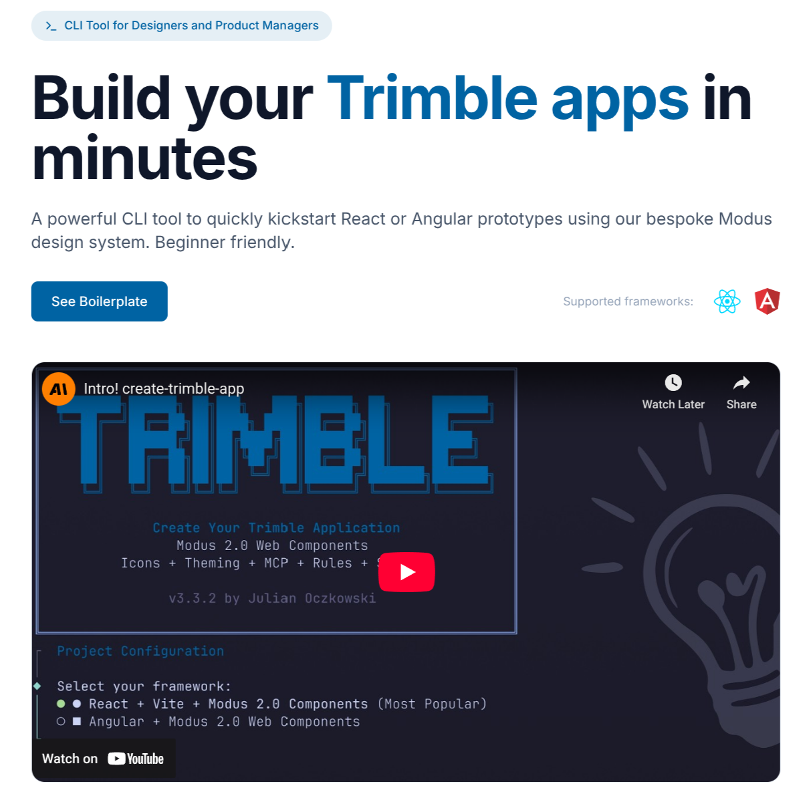

# Create Modus App


Interactive CLI to scaffold Modus 2.0 web component applications for React and Angular.

**Templates are bundled directly** - no external downloads, works fully offline.

> **Get Started Now:**
>
> ```bash
> npx @julianoczkowski/create-trimble-app@latest
> ```
>
> If you run into permission issues, try: `sudo npx @julianoczkowski/create-trimble-app@latest`

---

<p align="center">
  <a href="https://julianoczkowski.github.io/trimble-app/">
    
  </a>
</p>

## Features

- 📦 **Bundled Templates** - Templates included in package, no network required
- 🔒 **Secure** - No runtime external dependencies
- ⚛️ **React** - React + Vite + Modus 2.0 Components + Cursor Rules
- 🅰️ **Angular** - Angular + Modus 2.0 Web Components + Cursor Rules
- 🎯 **Interactive** - Premium CLI experience with Trimble branding
- ⚡ **Fast** - Local file copy, instant setup

## Usage

### Interactive Mode (Recommended)

```bash
npx @julianoczkowski/create-trimble-app@latest
```

This will guide you through:

1. Framework selection (React or Angular)
2. Installation location choice
3. Project name input
4. Optional dependency installation

### Command Line Options

```bash
# Create with project name
npx @julianoczkowski/create-trimble-app@latest my-app

# Specify framework
npx @julianoczkowski/create-trimble-app@latest my-app --framework react

# Install in current folder
npx @julianoczkowski/create-trimble-app@latest --current-folder

# Preview without creating files
npx @julianoczkowski/create-trimble-app@latest my-app --dry-run

# Enable verbose output
npx @julianoczkowski/create-trimble-app@latest my-app --verbose

# Show CLI information
npx @julianoczkowski/create-trimble-app@latest --info

# Skip dependency installation
npx @julianoczkowski/create-trimble-app@latest my-app --no-install

# Show help
npx @julianoczkowski/create-trimble-app@latest --help
```

## CLI Options

| Option                   | Description                            |
| ------------------------ | -------------------------------------- |
| `[project-name]`         | Name of the project to create          |
| `-f, --framework <name>` | Framework to use (react, angular)      |
| `--current-folder`       | Install in current folder              |
| `--dry-run`              | Preview what would be created          |
| `--verbose`              | Enable verbose output for debugging    |
| `--info`                 | Show information about this CLI        |
| `--no-install`           | Skip automatic dependency installation |
| `-v, --version`          | Display version number                 |
| `-h, --help`             | Display help                           |

## Supported Frameworks

| Framework      | Description  | What's Included                                                                                          |
| -------------- | ------------ | -------------------------------------------------------------------------------------------------------- |
| ⚛️ **React**   | React + Vite | Modus 2.0 Components, TypeScript, Tailwind CSS, 40+ Cursor Rules, GitHub Templates, Code Quality Scripts |
| 🅰️ **Angular** | Angular 20+  | Modus 2.0 Web Components, TypeScript, Tailwind CSS, 11 Cursor Rules, GitHub Workflows, Demo Components   |

## What's Included in Each Template

Both templates come fully configured with:

```
your-project/
├── .cursor/           # Cursor IDE rules for Modus development
│   ├── rules/         # 40+ AI development rules
│   └── commands/      # AI-powered scaffolding commands
├── .github/           # Issue templates, PR template, CI workflows
├── .husky/            # Git hooks (pre-commit)
├── .vscode/           # VS Code extensions & settings
├── docs/              # Documentation
├── scripts/           # Code quality check scripts
├── src/               # Source code with demo components
├── package.json       # All dependencies configured
└── README.md          # Getting started guide
```

### Cursor Commands

Both templates include AI-powered Cursor commands for rapid scaffolding:

| Command              | Description                                                       |
| -------------------- | ----------------------------------------------------------------- |
| `scaffold-shell-app` | Create a complete app shell with navbar, side navigation, routing |

To use: Open Cursor IDE, press `Cmd+K` (Mac) or `Ctrl+K` (Windows/Linux), and run the command. The AI will guide you through a conversational setup flow to customize your navigation items.

## Architecture

```
┌─────────────────────────────────────────────────────────────┐
│                    npx create-trimble-app                   │
├─────────────────────────────────────────────────────────────┤
│  1. Parse CLI arguments (Commander.js)                      │
│  2. Show branded welcome header (boxen + Trimble Blue)      │
│  3. Interactive prompts with threaded UI (@clack/prompts)   │
│  4. Copy bundled template (local file copy)                 │
│  5. Update package.json with project name                   │
│  6. Install dependencies silently (optional)                │
│  7. Show beginner-friendly success message                  │
└─────────────────────────────────────────────────────────────┘
```

For detailed architecture documentation, see [docs/architecture.md](docs/architecture.md).

## Security

This CLI is designed with security as a priority:

- **No External Downloads** - Templates are bundled in the npm package
- **Works Offline** - No network required to create projects
- **npm Provenance** - Published with provenance attestation
- **Minimal Dependencies** - Only essential runtime dependencies

Unlike other scaffolding tools that download templates from GitHub at runtime, this CLI bundles templates directly. This eliminates:

- Supply chain attacks from compromised repositories
- Network failures during project creation
- Version drift between CLI and templates

## Requirements

- Node.js 18 or higher
- npm, yarn, or pnpm

## Development

```bash
# Clone this repository
git clone https://github.com/julianoczkowski/create-trimble-app.git
cd create-trimble-app

# Install dependencies
npm install

# Run locally
npm run dev

# Run tests
npm test

# Test specific commands
node bin/create-trimble-app.js --help
node bin/create-trimble-app.js my-app --framework react --dry-run
```

For detailed testing instructions, see [docs/local-testing.md](docs/local-testing.md).

## Documentation

| Document                               | Description                    |
| -------------------------------------- | ------------------------------ |
| [Architecture](docs/architecture.md)   | How the CLI works internally   |
| [Local Testing](docs/local-testing.md) | How to test during development |

## Contributing

1. Fork the repository
2. Create your feature branch (`git checkout -b feature/amazing-feature`)
3. Run tests (`npm test`)
4. Commit your changes (`git commit -m 'Add some amazing feature'`)
5. Push to the branch (`git push origin feature/amazing-feature`)
6. Open a Pull Request

## License

MIT © Julian Oczkowski

## Issues & Discussions

Report bugs, request features, and discuss ideas:

- [Support & Onboarding](https://julianoczkowski.github.io/trimble-app/)

## Related

- [Modus Web Components Documentation](https://trimble-oss.github.io/modus-wc-2.0/main/?path=/docs/documentation-getting-started--docs)
- [Modus Icons](https://modus-icons.trimble.com/)
- [Trimble Modus Design System](https://modus.trimble.com)

---

**Made with ❤️ for the Trimble community**
